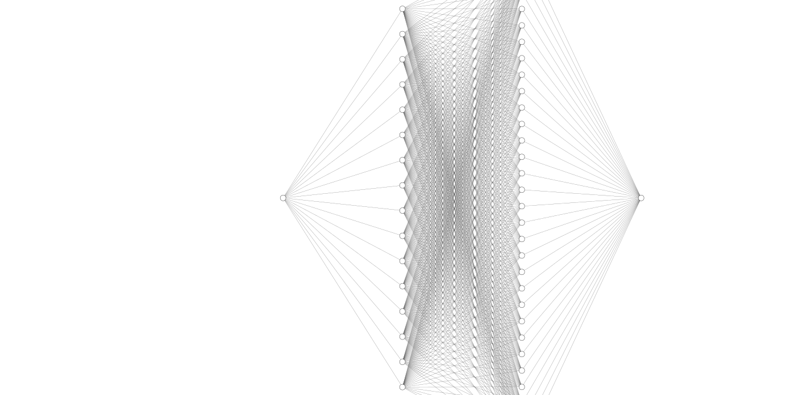

# Developing a Neural Network Regression Model

## AIM

To develop a neural network regression model for the given dataset.

## THEORY

Design and implement a neural network regression model to accurately predict a continuous target variable based on a set of input features within the provided dataset. The objective is to develop a robust and reliable predictive model that can capture complex relationships in the data, ultimately yielding accurate and precise predictions of the target variable. The model should be trained, validated, and tested to ensure its generalization capabilities on unseen data, with an emphasis on optimizing performance metrics such as mean squared error or mean absolute error. This regression model aims to provide valuable insights into the underlying patterns and trends within the dataset, facilitating enhanced decision-making and understanding of the target variable's behavior.


## Neural Network Model



## DESIGN STEPS

### STEP 1:

Loading the dataset

### STEP 2:

Split the dataset into training and testing

### STEP 3:

Create MinMaxScalar objects ,fit the model and transform the data.

### STEP 4:

Build the Neural Network Model and compile the model.

### STEP 5:

Train the model with the training data.

### STEP 6:

Plot the performance plot

### STEP 7:

Evaluate the model with the testing data.

## PROGRAM
### Name: PRAVIN KUMAR A.
### Register Number: 212223230155
```python

import pandas as pd
from sklearn.model_selection import train_test_split
from sklearn.preprocessing import MinMaxScaler
from tensorflow.keras.models import Sequential
from tensorflow.keras.layers import Dense
from google.colab import auth
import gspread
from google.auth import default


auth.authenticate_user()
creds, _ = default()
gc = gspread.authorize(creds)
worksheet = gc.open('training data').sheet1

data = worksheet.get_all_values()
dataset1 = pd.DataFrame(data[1:], columns = data[0])
dataset1 = dataset1.astype({'Inputs':'float'})
dataset1 = dataset1.astype({'Outputs':'float'})
dataset1.head()

X = dataset1[['Inputs']].values
y = dataset1[['Outputs']].values
X_train,X_test,y_train,y_test = train_test_split(X,y,test_size = 0.33,random_state = 33)
Scaler = MinMaxScaler()
Scaler.fit(X_train)
X_train1 = Scaler.transform(X_train)
ai_brain = Sequential([
    Dense(16,activation = 'relu'),
    Dense(32,activation = 'relu'),
    Dense(1)
])

ai_brain.compile(optimizer = 'rmsprop', loss = 'mse')
ai_brain.fit(X_train1, y_train,epochs = 1000)


```
## Dataset Information


## OUTPUT

### Training Loss Vs Iteration Plot


### Test Data Root Mean Squared Error


### New Sample Data Prediction


## RESULT

To develop a neural network regression model for the given dataset is created sucessfully.
